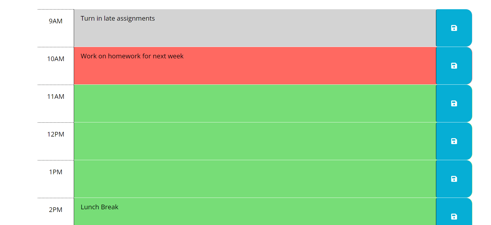

# ScheduleCreater

Table of Contents
    - Description
    - Visual
    - Link

# Description
    Creating a schedule involves designing a program that allows users to input events, dates, and times and then organize them into a coherent timetable. To keep things simple, I'll provide a step-by-step guide to create a basic command-line schedule in Visual Studio Code. 

# Visuals
    

# Link
    [Work Day Scheduler] (http://127.0.0.1:5501/index.html)
    